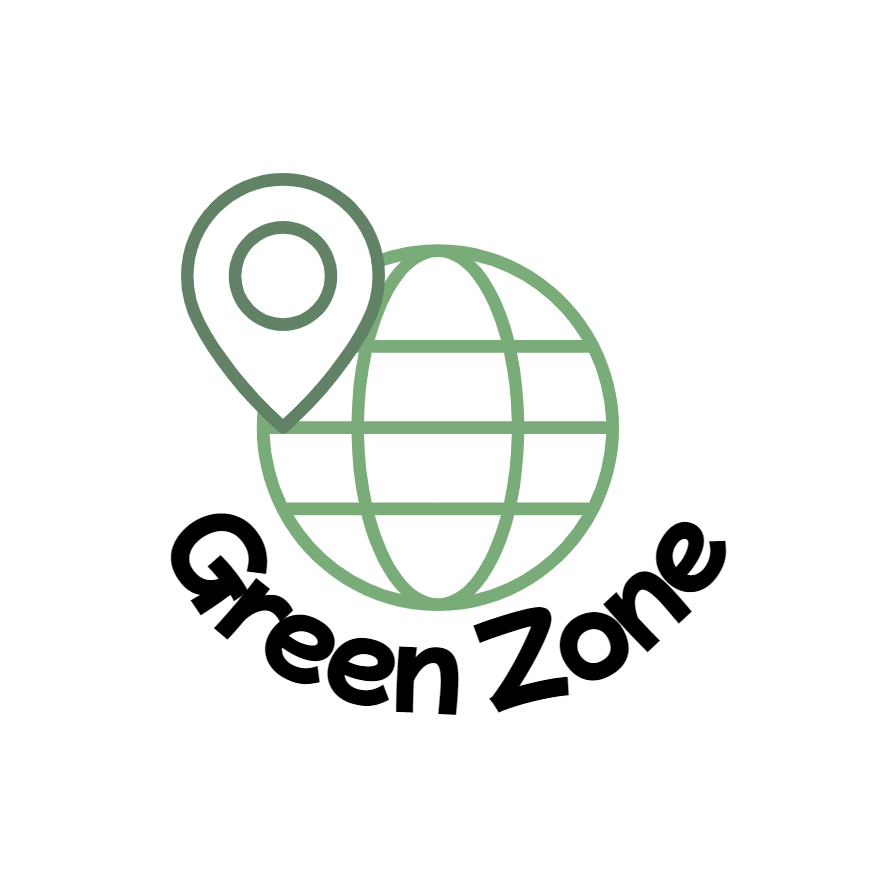

    
    <h1>GreenZone</h1>

## GreenZone API?
This repository is socket server for `GreenZone`.
We using `Socket.IO` and `Express`, `http` for socket server,
And using typescript and zod for typings.

## API Features
- Room
    - create
    - find
    - info
    - join
- Coords
    - update

## TODO?
- [x] Add set title feature
- [ ] Add set safe area feature
- [ ] Add send Anouncement feature
- [ ] Add send warning feature
- [ ] Add kick member feature
- [ ] Add destroy room feature
- [ ] Add get special member infomation feature